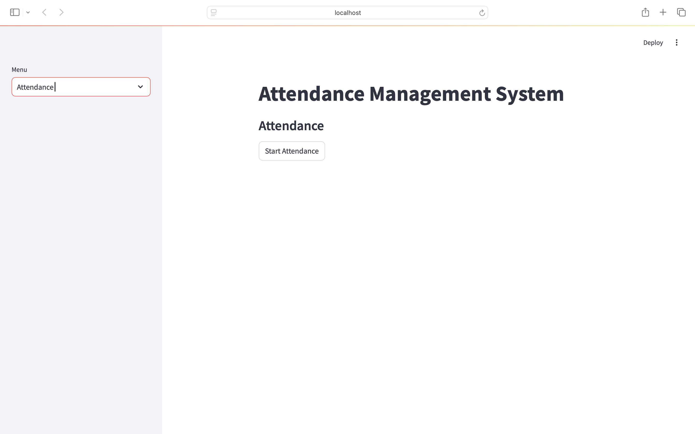

## Introduction

Manual attendance tracking is time-consuming and prone to errors. To solve this, I developed an **Attendance Management System** that uses facial recognition to automate the process. This project combines Python, OpenCV, and Streamlit to create a user-friendly web application for both students and administrators.


## What is Face Recognition?

Face recognition is a computer vision technique that identifies or verifies a person from a digital image or video frame. It works by detecting faces, extracting features, and comparing them to known faces in a database. In this project, we use OpenCV's face recognition capabilities to identify students and mark their attendance.

## Key Features (Explained)

- **Student Registration:**
  - Enter a student's name and roll number.
  - The system uses your webcam to capture multiple images of the student from different angles and expressions. This helps the model recognize the student more accurately later.
- **Model Training:**
  - After capturing images, the system processes them and trains a face recognition model. This model learns to distinguish between different students based on their facial features.
- **Real-Time Attendance:**
  - The app uses your webcam to scan faces in real time. When a registered student is recognized, their attendance is automatically marked in the database.
- **Database Viewing:**
  - The app provides an interface to view and manage both the student list and attendance records. You can see who is registered and who has attended.

## How Does It Work? (Step-by-Step)

### 1. Registering a Student

1. **Launch the app:**
   ```bash
   streamlit run app.py
   ```
2. **Select Register Student:**
   - Use the sidebar to choose "Register Student."
3. **Enter Details:**
   - Fill in the student's name and roll number.
4. **Capture Images:**
   - Click "Register." The webcam will open and automatically take several pictures of the student. These images are saved for training.

*Why multiple images?* Different lighting, angles, and expressions help the model learn to recognize the student in various conditions.


### 2. Training the Model

- After registration, the system processes the captured images. It detects faces in each image, extracts unique features, and updates the recognition model. This step is crucial for accurate identification.

*What is a model?* In machine learning, a model is a program that has been trained to recognize patterns—in this case, faces. The more data (images) it has, the better it performs.

### 3. Marking Attendance

1. **Select Attendance:**
   - In the sidebar, choose "Attendance."
2. **Start Attendance:**
   - Click "Start Attendance." The webcam will scan faces in real time.
3. **Automatic Marking:**
   - When a registered face is detected, the system marks the student's attendance in the database. No manual input is needed!

*How does recognition work?* The system compares the face it sees to the faces it has learned. If it finds a match, it records the student's attendance.



### 4. Viewing Databases

- **View Databases:**
  - Select this option in the sidebar to see all registered students and attendance records. You can check who is present, absent, or view historical data.

## File Structure (Detailed)

- `app.py`: The main Streamlit app. Handles the user interface and connects all features.
- `takeimages.py`: Script for capturing student images using the webcam.
- `train.py`: Script for training the face recognition model with the captured images.
- `test.py`: Script for running the recognition and marking attendance.
- `requirements.txt`: Lists all Python packages needed. Install them with `pip install -r requirements.txt`.
- `students.csv`: Stores student names and roll numbers in a spreadsheet format.
- `attendance.csv`: Stores attendance records (who was present and when).
- `TrainingImage/`: Folder where all captured student images are saved.
- `TrainingImageLabel/`: Folder for the trained model and label files (used for recognition).

## How to Set Up and Use the System

1. **Install Dependencies:**
   ```bash
   pip install -r requirements.txt
   ```
2. **Run the App:**
   ```bash
   streamlit run app.py
   ```
3. **Register Students:**
   - Use the sidebar to register new students and capture their images.
4. **Train the Model:**
   - The app will automatically train the model after registration.
5. **Mark Attendance:**
   - Use the "Attendance" option to start face recognition and mark attendance.
6. **View Records:**
   - Use the "View Databases" option to see all data.

## Frequently Asked Questions

**Q: What if the system doesn't recognize a student?**
- Make sure the student was registered with clear images. Try registering again with better lighting and different angles.

**Q: Can I add more students later?**
- Yes! You can register new students at any time. The model will update automatically.

**Q: Is my data safe?**
- All data is stored locally in CSV files. No images or records are uploaded online.

**Q: What if I don't have a webcam?**
- The system requires a webcam for capturing and recognizing faces. It won't work without one.

## How Face Recognition Works (Technical Overview)

1. **Face Detection:**
   - The system uses a pre-trained Haar Cascade classifier (from OpenCV) to find faces in images.
2. **Feature Extraction:**
   - It extracts unique features from each face (like the distance between eyes, shape of the jaw, etc.).
3. **Model Training:**
   - These features are used to train a machine learning model (often an LBPH recognizer in OpenCV).
4. **Recognition:**
   - When a new face is seen, the model compares its features to those in the database and finds the closest match.

## Machine Learning Models Used

### 1. Haar Cascade Classifier (for Face Detection)

- **What is it?**
  - The Haar Cascade is a machine learning-based object detection algorithm used to identify faces in an image or video stream. It is pre-trained on thousands of positive (face) and negative (non-face) images.
- **Why use it?**
  - It is fast, lightweight, and works well for real-time face detection. OpenCV provides ready-to-use Haar Cascade models for face and eye detection.
- **What does it do?**
  - Scans the image frame-by-frame and draws a rectangle around detected faces. Only the face region is passed to the next stage (recognition).

### 2. LBPH Face Recognizer (for Face Recognition)

- **What is it?**
  - LBPH stands for Local Binary Patterns Histograms. It is a simple yet powerful algorithm for face recognition, available in OpenCV.
- **Why use it?**
  - LBPH is robust to changes in lighting and facial expressions, and works well with small datasets (like classroom or office attendance). It is easy to train and fast to run, making it ideal for real-time applications.
- **What does it do?**
  - Converts each face image into a grid of small cells, computes a binary pattern for each cell based on pixel intensity, and builds a histogram of these patterns. During recognition, it compares the histogram of the detected face to those in the database and finds the closest match.

#### Why Not Use Deep Learning Models?
- Deep learning models (like CNNs) require large datasets and more computational power (often a GPU). For small projects and real-time use on standard laptops, classical models like Haar Cascade and LBPH are more practical and efficient.

## Summary Table

| Model                | Purpose           | Why Chosen?                                 |
|----------------------|-------------------|---------------------------------------------|
| Haar Cascade         | Face Detection    | Fast, lightweight, real-time, easy to use   |
| LBPH Face Recognizer | Face Recognition  | Robust, simple, works with small datasets   |

## Acknowledgements

- [OpenCV](https://opencv.org/) for image processing and facial recognition.
- [Streamlit](https://streamlit.io/) for the web interface.

---

*Automate your attendance management with face recognition and make your workflow smarter!*
